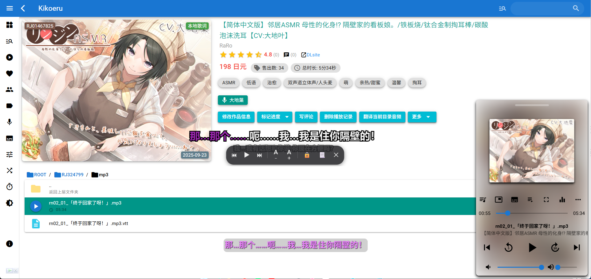
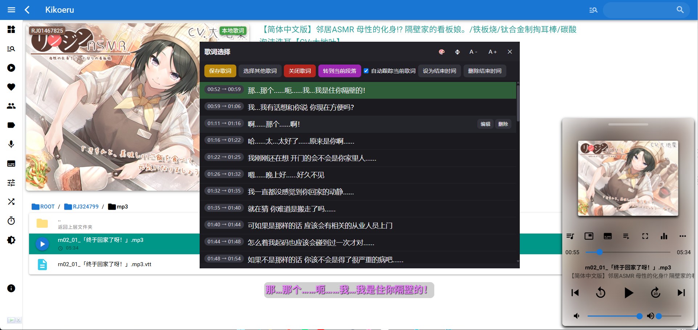
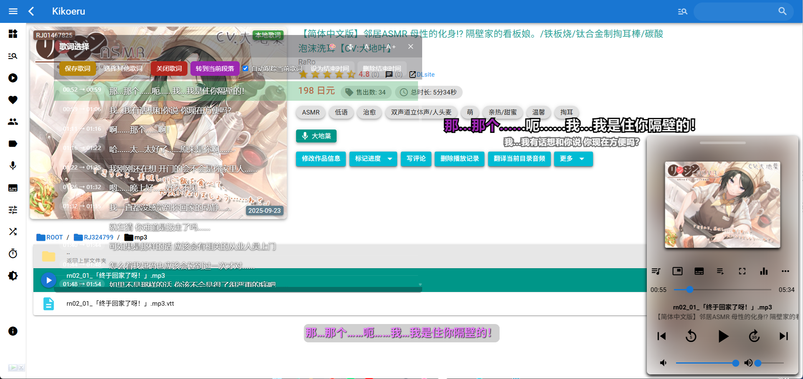
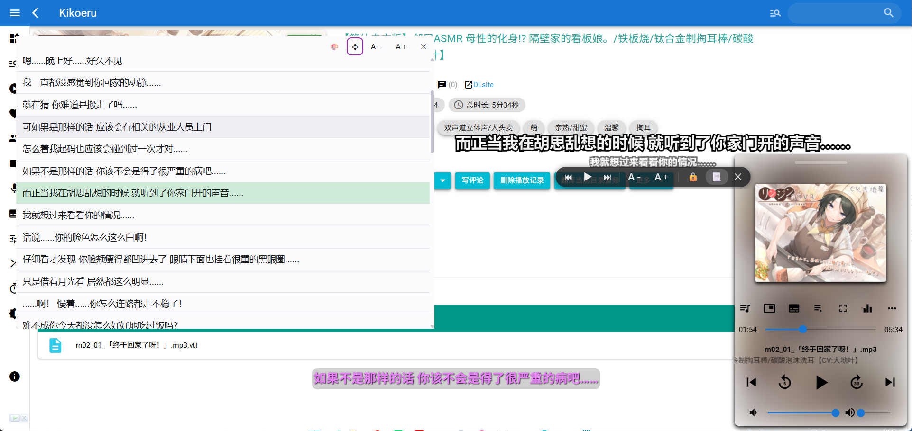

# Kikoeru 桌面歌词

将网页播放器中的播放状态和歌词同步到独立的 Electron 悬浮窗口。播放网页仍由浏览器负责，桌面端只负责显示、控制和歌词编辑，不修改站点页面源码。

目前支持 Kikoeru 自建站点和 [ASMR.ONE](https://asmr.one/)，两个站点各有一份用户脚本，共用同一个桌面端。

项目由两部分组成：

- `desktop/`：Electron 桌面应用，包含悬浮歌词、歌词选择窗口、托盘菜单和本地 Bridge 服务。
- `userscript/`：Tampermonkey/Violentmonkey 用户脚本，负责从网页读取播放器状态和歌词，并转发桌面端命令。

## 支持的站点

| 站点     | 用户脚本                          | 默认匹配地址                                   | 歌词来源                                | 歌词编辑/保存 |
| -------- | --------------------------------- | ---------------------------------------------- | --------------------------------------- | ------------- |
| Kikoeru  | `kikoeru-desktop-lyrics.user.js`  | `http://127.0.0.1:8888/*`                      | 旁路观察页面的 `/api/media/*-lrc` 请求  | 支持          |
| ASMR.ONE | `asmr-one-desktop-lyrics.user.js` | `https://asmr.one/*`、`https://www.asmr.one/*` | 直接读取页面 Vuex 的 `AudioPlayer` 状态 | 只读          |

两份脚本使用各自独立的 `localStorage` 配置项，可以同时安装、互不影响；每个标签页仍然是一个独立的音源（source）。

## 功能

- 无边框、置顶的悬浮歌词窗口，支持逐字高亮、下一行预览、描边和透明背景。
- 播放/暂停、上一曲、下一曲、拖动定位，以及歌词选择窗口快捷入口。
- 歌词选择、编辑、删除、设置结束时间、切换歌词文件和保存歌词文件（依赖 Kikoeru 的 `save-lrc` 接口；ASMR.ONE 下歌词为只读）。
- 深色、浅色、透明三种歌词选择主题，以及精简模式和字号调整。
- 多个标签页同时连接时，每个标签页拥有独立的歌词选择窗口；悬浮歌词自动跟随当前播放音源。Kikoeru 与 ASMR.ONE 的标签页可以同时连接同一个桌面端。
- 托盘常驻、鼠标穿透锁定（`Ctrl+Alt+L`）和窗口位置/样式持久化。
- Bridge 仅监听回环地址 `127.0.0.1`，可选 Secret 鉴权，不保存或转发站点的登录凭据。

## 界面预览



## 使用前提

- Windows（当前打包目标为 Windows x64 portable）。
- 可正常访问 Kikoeru 或 ASMR.ONE 的浏览器和登录会话。
- Tampermonkey 或 Violentmonkey。
- 从源码运行或构建需要 Node.js 和 npm。

## 安装与连接

### 1. 安装桌面端

请从项目 GitHub 的 [Releases](../../releases/latest) 下载最新的 `kikoeru-desktop-lyrics-*.zip`，解压后运行其中的 `desktop-lyrics.exe`。应用启动后会驻留在系统托盘。

### 2. 安装用户脚本

按站点选择对应脚本，交给 Tampermonkey/Violentmonkey 安装：

- **Kikoeru**：在上一步下载的压缩包中打开 `kikoeru-desktop-lyrics.user.js`。脚本默认匹配 `http://127.0.0.1:8888/*`；如果 Kikoeru 使用其他地址，请在脚本头部修改 `@match`，并按实际地址收窄匹配范围。
- **ASMR.ONE**：安装仓库中的 [`userscript/asmr-one-desktop-lyrics.user.js`](userscript/asmr-one-desktop-lyrics.user.js)。脚本默认匹配 `https://asmr.one/*` 和 `https://www.asmr.one/*`，通常无需修改。

两份脚本可以同时安装，配置互相独立。

### 3. 配置 Bridge

1. 启动 Electron 桌面端。
2. 在 Kikoeru 或 ASMR.ONE 页面打开用户脚本管理器菜单，选择「配置 Electron Bridge」。
3. 填入 Bridge 地址和 Secret。默认地址为 `http://127.0.0.1:18765`，Secret 默认为空。
4. 播放任意曲目，悬浮歌词窗口会自动接收播放状态和歌词。

也可以从托盘菜单打开「Bridge 设置」查看或修改端口和 Secret。配置会保存在 Electron 的 `userData` 目录，网页脚本配置则保存在当前站点的 `localStorage`；两个站点需要各自配置一次。

用户脚本的协议、权限和歌词 API 说明见 [`userscript/README.md`](userscript/README.md)。

## 从源码运行

```powershell
Set-Location -LiteralPath 'desktop'
npm install
npm start
```

开发启动会直接运行 Electron 主进程，不需要额外启动 HTTP 服务。Bridge 默认监听 `127.0.0.1:18765`。

## 构建 Windows 便携版

```powershell
Set-Location -LiteralPath 'desktop'
npm install
npm run build
```

构建结果输出到 `desktop/dist/`，便携版文件名为 `desktop-lyrics.exe`。

向仓库推送形如 `v0.1.0` 的 Git 标签后，GitHub Actions 会自动构建并创建 Release，Release 中的 ZIP 包含桌面端和 Kikoeru 用户脚本；ASMR.ONE 用户脚本目前请直接从仓库的 `userscript/` 目录安装。

## Bridge 配置

Bridge 配置可通过环境变量覆盖持久化配置：

| 变量                    | 说明                    | 默认值   |
| ----------------------- | ----------------------- | -------- |
| `DESKTOP_LYRICS_PORT`   | 监听端口（1-65535）     | `18765`  |
| `DESKTOP_LYRICS_SECRET` | 请求鉴权 Secret，可为空 | 空字符串 |

例如在 PowerShell 中使用自定义端口启动：

```powershell
$env:DESKTOP_LYRICS_PORT = '18766'
$env:DESKTOP_LYRICS_SECRET = 'change-me'
npm start
```

Bridge 只绑定 `127.0.0.1`，网页端通过 SSE 接收命令。Kikoeru 脚本使用当前页面的登录身份访问歌词接口，ASMR.ONE 脚本只读取页面内已加载的歌词状态；两种情况下 Electron 都不直接接触站点的 Cookie 或 JWT。

## 常见问题

### 悬浮窗显示“等待 Kikoeru 网页端”

确认桌面端正在运行，用户脚本已启用且 `@match` 覆盖当前站点地址；然后在脚本菜单中重新保存 Bridge 地址。若设置过 Secret，请确保两端完全一致。

### Bridge 启动失败

端口被占用时，在托盘「Bridge 设置」中换用其他端口，并同步更新用户脚本配置。也可以检查 `DESKTOP_LYRICS_PORT` 是否设置为合法的 1-65535 整数。

### 歌词选择窗口没有内容

先确认当前曲目已播放并等待页面加载歌词。

- **Kikoeru**：脚本通过页面自身的 `fetch` 观察 `/api/media/check-lrc`、`query-lrc` 和 `fetch-lrc` 请求；如果页面结构或接口发生变化，可能需要更新脚本中的适配逻辑。
- **ASMR.ONE**：脚本从页面 Vuex 的 `AudioPlayer.lrcLines` 读取歌词，因此只有站点自身已经加载出歌词的曲目才有内容，且不提供歌词文件列表和保存功能。

### ASMR.ONE 上保存歌词失败

ASMR.ONE 没有对应的写入接口，脚本不实现 `saveLyrics`，歌词选择窗口中的保存操作会返回“未知命令”。该站点下请把歌词选择窗口当作只读的查看和定位工具。

## Screenshot







## 目录结构

```text
desktop/
  main/       Electron 主进程、Bridge 客户端/服务和窗口管理
  preload/    渲染进程受限 API
  renderer/   悬浮歌词、歌词选择和 Bridge 设置页面
  build/      应用图标和托盘图标
userscript/
  kikoeru-desktop-lyrics.user.js    Kikoeru 适配脚本
  asmr-one-desktop-lyrics.user.js   ASMR.ONE 适配脚本
  README.md
```

## 许可证

GPL-3.0-or-later，详见 [`desktop/package.json`](desktop/package.json)。
